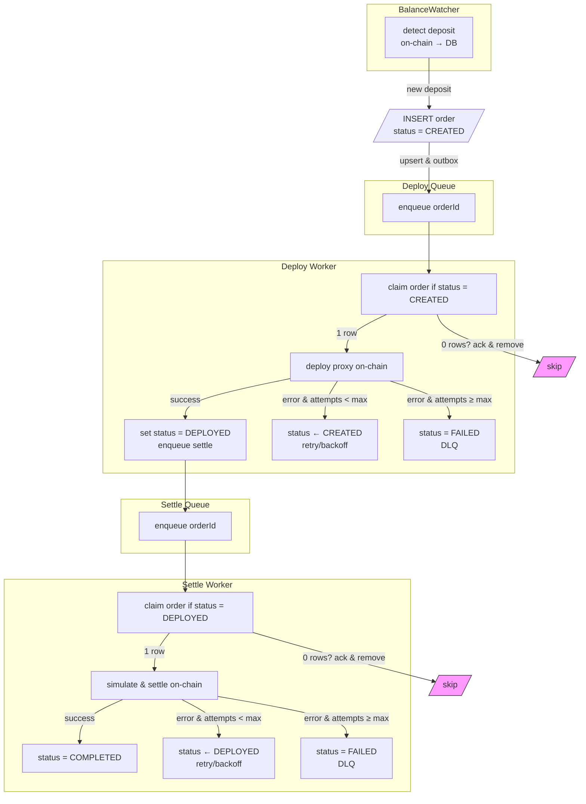
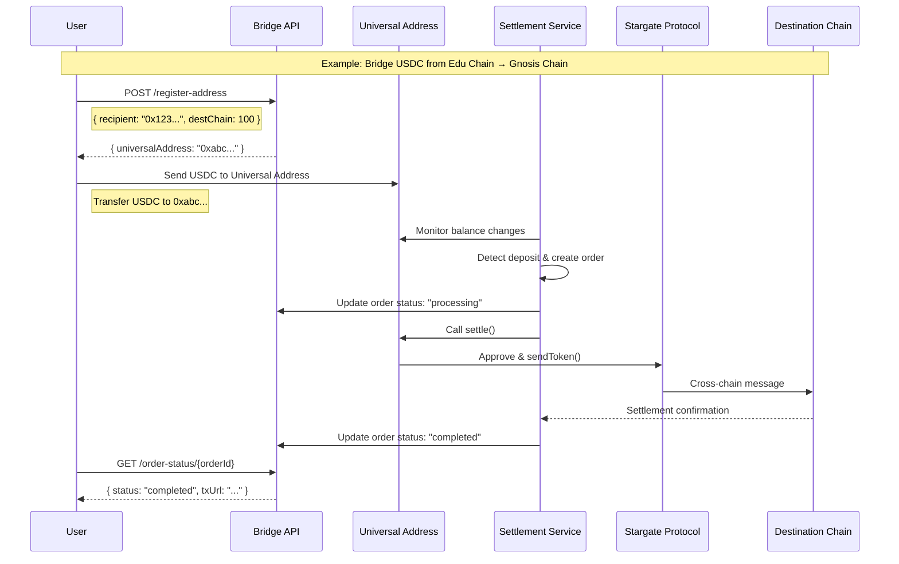

## Smart Contract

### Universal Deposit address

1. Functions
    1. `settle() (public, payable)`
        1. quote fee (how much can be sponsored? are we going to make user pay for it?)
            1. 3 parts
                1. 6bps on USDC
                2. gas fee (Sponsored by Paymaster if AA is used)
                3. lz_fee, in native gas token
            2. gas fee in native token https://stargateprotocol.gitbook.io/stargate/v2-user-docs/whats-new-in-stargate-v2/fees#stargate-gas-fees
            3. dynamic transfer fee https://stargateprotocol.gitbook.io/stargate/v2-user-docs/whats-new-in-stargate-v2/fees#stargate-transaction-fees-rebates
        2. call USDC.approve(Stargate) & Stargate.sendToken
        3. nonce +=1
        4. emit `Settled(uint256 indexed amount, address indexed recipient, uint256 indexed destination chain id)`
        5. require `USDC.balanceOf(address(this))>minAmount`
    2. `receive() external payable`
        1. revert
    3. `withdrawToken(token, receiver) onlyOwner` (=Refund address)
        1. Allow the owner to withdraw
        2. Prerequisite: the contract has to be first deployed & set the owner
        3. emit `TokenWithdrawn(address indexed token, address indexed receiver, uint256 indexed amount)`
    4. supportedToken (view)
        1. return USDC.e address
    5. owner (view)
        1. refundAddress (specified by user when first creating the wallet)
    6. nonce (view)
        1. unique nonce to identify each of the settle transaction, incremental by 1
    7. version (view)
        1. return `1.0.0`
2. Ownership
    1. `refundAddress` when specify through API `/registerAddress`
    2. Note: hard to track manually which address has sent the token to the universal address since we only track the balance increase of the address.

### Proxy

1. https://github.com/OpenZeppelin/openzeppelin-contracts/blob/v5.4.0/contracts/proxy/Proxy.sol
    1. Allow all the proxy clones to point to the same implementation contract, after upgrading.
2. Functions
    1. `implementation` (view)
    2. `upgradeTo` (write, onlyOwner)
    3. `owner` (view)
3. Initialize owner for the implementation contract.

## Proxy Factory

1. Functions
    1. `createUniversalAddress(address refundAddress, address recipient, address destination token address)` (public, payable)
        1. call create2 with salt (destination chain id: 100, token: USDC.e on Gnosis, recipient address on Gnosis) to create the proxy contract, initialize (owner: refundAddress)
        2. initialize the owner within the same transaction
        3. emit `UniversalAccountCreated(address indexed universal address)`
    2. `getUniversalAddress(address refundAddress, address recipient, address destination token address)` (view)

## Backend

1. Off chain services

    1. Three major workers
        1. BalanceWatcher: track USDC balance of the universal address
            1. Watch a list of universal addresses in the cache, and create an order if the USDC balance of the amount is larger than threshold.
        2. Deployer: Deploy universal deposit by calling factory (skip if the universal address is already defined)
        3. Settler:
            1. quote fee
            2. Simulate & Call `settle` function and pay gas fee for user (estimation of fee)
            3. Speed: fast mode(Taxi) as default, can configure to economic mode (Bus) in the next phase.
    2. Redis is used for cached, Postgre is used for Database, RabbitMq/BullMq for queue.
    3. Error handling
        1. Retry for 5 times after receiving error within certain operation and abandon the order if threshold reached, set STATUS as FAILED → Trigger Alerts.
        2. The error will most likely coming from on chain bridge operation (i.e. bridge limit reached, not enough credit from Stargate), hence we need to have exponential time for fallback operation.
    4. Requirement
        1. No duplicate order in the process.

1. Order workflow:
    1. Order Creation: When BalanceWatcher detected balance > threshold, it creates an order in database and push the order into the deploy queue.
        1. ORDER STATUS: CREATED
        2. Deploy queue will check if universal address is deployed (creationCode > 0), and call proxy factory for deployment. Once finished, pushed to Settle Queue.
            1. ORDER STATUS: DEPLOYED
    2. Order Settlement:
        1. quote fee for the settle function call → simulate `settle` function call → call on chain `settle` function → update the url of bridging transaction from ${layerzero scan url}/${txHash}
        2. ORDER STATUS: COMPLETED
    3. Error handling:
        1. ORDER STATUS: FAILED , ${err msg}
1. Order Status Flow
    1. A deposit is detected, and an order is created (`CREATED`).
    2. The proxy contract is deployed if it doesn't exist (`DEPLOYED`).
    3. The `settle()` function is called, initiating the bridge (`INITIATED`).
    4. The bridge transaction is confirmed (`COMPLETED`).

> The `nonce` is a critical link between the off-chain order schema and the on-chain smart contract state. Each successful `settle()` call increments the contract's nonce, ensuring that the `keccak256` hash for subsequent orders will be unique.

1. API
    1. Endpoint
        1. `registerAddress`
            1. input: recipient address, destination token address, destination chain id, refund address
            2. output: universal address
            3. TTL: 24 hrs
            4. Use case:
                1. To get the universal address
                2. To store the universal address in cache for the balance watcher.
        2. `getOrderByParams`
            1. input: universal address, source chain id, nonce (contract nonce). One can query the latest nonce by calling on-chain contract `nonce`.
            2. output: Order information (Check the Order schema below)
        3. `getOrderById`
            1. input: order Id
            2. output: Order information (Check the Order schema below)
        4. `getOrderId`
            1. input: {nonce, source chain Id, destination chain Id, destination token, recipient address}
            2. output: Order Id
        5. `health`
        6. `supportedRoutes`
            1. return {routes: [`source chain Id`, `destination chain id`]}
    2. API authentication
    3. Rate limiting
2. Error Handling

### Order Schema

-   **id**: `String`
    -   A unique order identifier. The docs specify this is generated by `keccak256(universal-address, destination recipient, destination token, destination chain, nonce)`.
-   **universalAddress**: `String`
    -   The unique deposit address for the user, a proxy contract on the source chain.
-   **sourceChainId**: `Number`
    -   The chain ID where the user's funds originate (e.g., Edu Chain).
-   **destinationChainId**: `Number`
    -   The chain ID where the funds are being sent (e.g., Gnosis Chain).
-   **recipientAddress**: `String`
    -   The address on the **destination chain** that will receive the funds.
-   **destinationTokenAddress**: `String`
    -   The address of the token on the **destination chain** to be received (e.g., USDC.e).
-   **refundAddress**: `String`
    -   The address designated by the user to own the universal address and receive any withdrawn tokens.
-   **nonce**: `Number`
    -   A unique, incremental number for each settlement transaction on the universal address.
-   **amount**: `Number`
    -   The amount of USDC deposited by the user, detected by the `BalanceWatcher`.
-   **status**: `String`
    -   The current state of the order, which can be one of the following:
        -   `CREATED`: The deposit has been detected, and an order has been created.
        -   `DEPLOYED`: The universal address has been deployed on-chain.
        -   `INITIATED`: The settlement process has started (this is a new, more granular state to add clarity to the flow).
        -   `COMPLETED`: The cross-chain bridge transaction has been successfully completed.
        -   `FAILED`: The order failed after the maximum number of retries.
-   **transactionHash**: `String` (optional)
    -   The transaction hash of the on-chain `settle()` call.
-   **bridgeTransactionUrl**: `String` (optional)
    -   A link to the LayerZero Scan or other relevant explorer for the cross-chain bridging transaction.
-   **timestamp**: `String`
    -   The timestamp of the order's creation. This should be an ISO 8601 formatted string for consistency.
-   **message**: `String` (optional)
    -   A string to store any relevant error messages or additional information about the order's status.
-   **retries**: `Number` (internal)
    -   An internal counter for the number of retry attempts for a failed operation. This is crucial for the error handling logic.

## Requirement

1. Output should be containerized into docker and easily managed by Devops.

## Edge case

1. User sends unsupported fund
    1. Either Call withdrawToken if they have the control to the owner address
    2. Or reach out to the bridge team for manual support if the owner is bridge team
2. User sends less than minimum amount of token
    1. User has to resend more token. Call `/registerAddress` API again.
3. User sends more than enough amount of token and the bridging limit is reach
    1. The system will reprocess the order after X amount of time.
        1. will first quote Stargate → quote the amount if correct → bridge the maximum amount available → batch the second one
4. User deposits on the wrong chain
    1. Reach out to the team and redeploy it as long as the route is supported by Stargate

## Limitation

1. All the USDC amount will be bridged as long as the limit is enough
2. No slippage configuration, bridge amount configuration
3. Calldata execution is not allowed

## Cost estimation

1. On chain caller cost:
    1. gas fee for calling `settle` (can be sponsored by EDU Chain AA Paymaster)
    2. native gas token in `msg.value` after calling `quoteFee` (has to pre-fund the caller and monitor the balance)
    3. 6bps charged from the bridging token. (automatically deducted from the USDC balance)

## Workflow

1. Top up (bridge USDC from Edu chain to Gnosis Chain)
    1. User inserts the recipient address on Gnosis Chain (Gnosis Pay address)
        1. API call `/registerAddress` `{refundAddress, token, recipientAddress}` and return the universal-address
        2. universal-address is now cached in database for TTL (24 hrs) for balance monitoring. One has to call `/registerAddress` again if not sending min amount of USDC to the universal-address.
    2. User sends the USDC to the universal-address
        1. Balance has increased and detected by the backend.
        2. Backend starts processing the fund
    3. Status of the order can be found by calling API /getStatusByOrderId
        1. Return the status and link to layerzero scan if the order is being processed
2. Withdraw (bridge USDC from Gnosis Chain to Edu Chain)
    1. same as top up but opposite direction

# FAQ

1. What is the USDC token type on Edu Chain?
    1. Hydra OFT

# Timeline

1. Smart contract development (1.5 weeks, excluding Audit)
    1. Smart contract
    2. Test
    3. Audit (on going once development is finished)
2. Backend development (3 weeks)
    1. Server
    2. Test
3. API development (2 weeks)
    1. Server
    2. Test
4. Docs & Miscellaneous (2 days)

Request from Devops

1. Deployment for the API site
2. Create server for hosting the backend and API
3. Monitoring setup for the caller balance.
